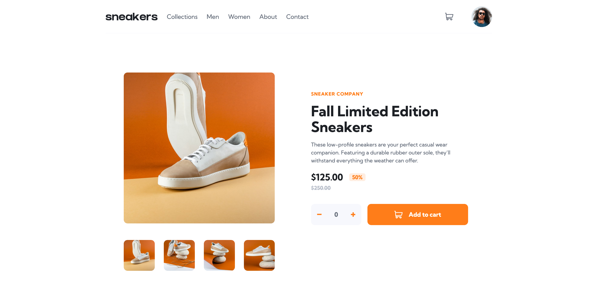

# Frontend Mentor - E-commerce product page solution

This is a solution to the [E-commerce product page challenge on Frontend Mentor](https://www.frontendmentor.io/challenges/ecommerce-product-page-UPsZ9MJp6). Frontend Mentor challenges help you improve your coding skills by building realistic projects.

## Table of contents

- [Overview](#overview)
  - [The challenge](#the-challenge)
  - [Screenshot](#screenshot)
  - [Links](#links)
- [My process](#my-process)
  - [Built with](#built-with)
- [Author](#author)

## Overview

Your challenge is to build out this e-commerce product page and get it looking as close to the design as possible.

### The challenge

Users should be able to:

   - Open a lightbox gallery by clicking on the large product image
   - Switch the large product image by clicking on the small thumbnail images
   - Add items to the cart
   - View the cart and remove items from it
    -View the optimal layout for the site depending on their device's screen size
   - See hover states for all interactive elements on the page

### Screenshot

### Links

- Live Site URL: [https://sparici.github.io/ecommerce-product-page/](https://sparici.github.io/ecommerce-product-page/)

## My process

### Built with

- Nuxt 3
- Semantic HTML5 markup
- CSS custom properties
- Flexbox
- Grid

## Author

- Frontend Mentor - [@SparicI](https://www.frontendmentor.io/profile/SparicI)

